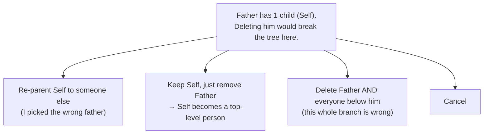
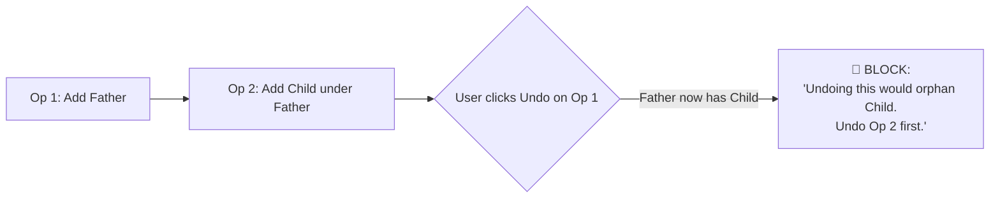

# Integrity Playbook — Deletion, Warnings & Undo (PM view)

> Companion to `INTEGRITY_RULES.md`. That doc is the *menu of rules*. This doc
> thinks like a product manager: **what should actually happen** when a user
> tries something risky — the father-with-a-child case, every cousin of it,
> and what undo does about it. Plain language, concrete names (Father, Self,
> Child). Still a proposal — nothing built yet.

---

## 1. Three promises that drive every decision

Every rule below serves one of three promises. When they conflict, this is the
priority order:

1. **Never corrupt.** The database must never end up split, orphaned, with a
   person in two families, a child with three parents, or a node belonging to
   "no tree." This is non-negotiable.
2. **Never strand the user.** If we block something, we must immediately show
   *how to get what they wanted* another way. A dead-end "Not allowed" with no
   path forward is a bug, not a feature.
3. **Never surprise silently.** If an action is allowed but has a side-effect
   (a child gets promoted, the family gets renamed, a spouse gets detached),
   we say so *before* they confirm — and it's undoable after.

So every risky action resolves to one of three responses:

| Response | When | Example |
|---|---|---|
| ✅ **Allow** (maybe confirm) | Safe, no side-effects | Delete a bottom-generation child with nothing under them |
| ⚠️ **Warn → confirm** | Valid, but has a visible side-effect | Delete a root → its children become top-level; family gets renamed |
| 🛑 **Block → offer a path** | Would corrupt/orphan | Delete Father who sits between Grandfather and Self |

---

## 2. The core question: "What happens to the child if Father is deleted?"

Short answer: **the child is never silently destroyed and never silently
orphaned.** What we do depends *only* on where Father sits.

### Case A — Father is a **bridge** (has parents AND children)
`Grandfather → Father → Self`

Deleting Father splits the tree: Grandfather on one side, Self (and everyone
below Self) floats off as a separate, parent-less tree. **This is the "middle
of the tree" case → 🛑 BLOCK.**

But we don't just say no — we open a **"Resolve children" helper** that asks
what they actually meant:

Each option is a clean, fully-undoable operation. The single "Delete" button
was hiding **three different intents** — the helper makes the user pick one.

### Case B — Father is a **root** (no parents, but has children)
`Father → Self` (Father is the top)

Deleting Father doesn't *break* anything upward (nothing's above him). Self
just becomes the new top.
- If Father has **one** child → ⚠️ **Warn**: "Self will become a top-level
  person and the family may be renamed. Continue?"
- If Father has **multiple** children with no sibling links between them →
  deleting him would split them into separate trees → 🛑 **Block + Resolve
  helper** (same as Case A).

### Case C — Father is a **co-parent** (child has another parent)
`Father + Mother → Self`

Deleting Father leaves Self still attached to Mother and the rest of the tree.
No orphan. → ✅ **Allow** (confirm: "Father will be removed; Self stays attached
to Mother").

### Case D — Father is a **leaf** (no children at all)
The bottom-generation / end-of-tree case you described. → ✅ **Allow**. If he
has a spouse, ⚠️ note the spouse will be detached.

> **The precise rule under all of this (R-A2): a deletion is allowed only if
> nobody becomes disconnected from the family afterward.** "No children" (R-A1)
> is the simple approximation; "no orphan / no split" is the exact version and
> it's what makes Cases B and C behave intuitively.

---

## 3. The reframe: "Delete" is really three buttons

The biggest product fix is to stop pretending deletion is one thing. Behind
one trash icon there are three intents:

| Intent | What the user means | Operation |
|---|---|---|
| **Remove person** | "This person shouldn't exist, but the people around them are real" | Detach + delete the one node; survivors get re-parented or promoted |
| **Fix a wrong link** | "Right child, wrong father" | Re-parent (we already have a reparent flow) — *no deletion at all* |
| **Remove a branch** | "This whole sub-family is bogus" | Cascade-delete the subtree as one undoable op |

We don't have to show three buttons up front — we show **one Delete**, and the
Resolve-children helper routes them to the right intent only when the node
isn't a clean leaf.

---

## 4. Undo is the same rules, running backwards

Here's the insight your question is really about. Every operation has a
"shape," and **undoing it is just the opposite-shape operation — so it must
obey the same safety rules.**

| You did | Undo is really a… | So undo can be blocked when… |
|---|---|---|
| Add Father | …delete of Father | Father has since gained a child (undo would orphan it) |
| Delete a leaf | …re-create of the leaf | The family it lived in was since deleted/merged away |
| Re-parent Self to a new mother | …re-parent back | The old mother was since deleted |
| Merge Family B into A | …split them apart | New nodes were added bridging both (the ambiguity case) |

### Your exact scenario, walked through

Undoing "Add Father" means deleting Father. Father now has a child. That's the
**exact** Case-A bridge problem — so undo refuses it and tells the user to undo
the *child* first. **Undo respects dependency order automatically because it
re-runs the deletion safety check (R-D6).**

This is why R-D6 ("undo is validated like a normal mutation") matters so much:
without it, undo becomes a back door that bypasses every other rule.

### The other undo trap: stale dependents

You add Father. You add Child. You re-parent Child to a *different* father,
Uncle. Now you undo "Add Father."
- Father is gone from Child's parents already (Child points to Uncle now), so
  undoing "Add Father" is safe → ✅ allowed.
- But if instead you undo the **re-parent**, Child would point back at
  Father — fine — *unless* Father was meanwhile deleted → 🛑 block.

The rule that saves us every time: **before restoring anything, re-check
cycles, the 2-parent limit, connectivity, and family existence. If the restore
would break any of them, refuse the whole undo (roll back, change nothing).**

---

## 5. Full scenario matrix

Quick reference for "what should happen." 🛑 block, ⚠️ warn+confirm, ✅ allow.

### Deleting a person
| Situation | Response | What happens to dependents |
|---|---|---|
| Leaf, no spouse | ✅ | nothing |
| Leaf with spouse | ⚠️ | spouse detached (kept as own node) |
| Co-parent (child has other parent) | ✅ | child stays attached to other parent |
| Root with 1 child | ⚠️ | child promoted to top-level; family may rename |
| Root with many unlinked children | 🛑 → Resolve helper | would split into many trees |
| Bridge (parents + children) | 🛑 → Resolve helper | re-parent / promote / cascade-delete |
| Claimed account / Self | 🛑 | only relationships can be detached |
| Family head (defines name) | ⚠️ | family is recomputed + renamed |

### Removing a relationship
| Situation | Response | Notes |
|---|---|---|
| Spouse edge (divorce) | ✅ but prefer **status flip** | keep history; don't hard-delete |
| Parent edge, child has another parent | ✅ | child stays connected |
| Parent edge, only link holding child's subtree | 🛑 | would split the tree |
| Sibling edge | ✅ | keep sibling-group consistent |

### Adding a node (creates future constraints)
| Situation | Response | Why it matters later |
|---|---|---|
| Add child under a leaf | ✅ | that leaf is no longer leaf-deletable (your point) |
| Add parent above a root | ⚠️ | family head + name may change |
| Add 2nd active spouse | 🛑→ second-spouse flow | avoids ambiguous "current spouse" |

### Merge & unmerge
| Situation | Response | Notes |
|---|---|---|
| Undo merge, no new activity, inside window | ✅ | clean split using provenance |
| Undo merge after new node added on top | 🛑 (sealed) | which tree does the new node belong to? |
| Undo merge after a node bridges both origins | 🛑 | no correct answer → refuse |
| Undo merge older than window | 🛑 | trees too entangled |
| Undo merge with a later merge stacked on it | 🛑 | unmerge newest-first only |

---

## 6. Recommended product behavior (my PM pick)

If I were shipping this, here's the package — it satisfies all three promises
with the least friction:

1. **Deletion = leaf-safe by default, with a Resolve-children helper.**
   Clean leaves delete instantly. Anything that would orphan/split opens the
   helper (re-parent / promote / cascade) instead of a dead-end error.
   *(Rules: R-A2 + the new "Resolve children" flow, which is R-A5 made
   friendly.)*

2. **Relationship removal blocked only when it disconnects.** Everything else
   (co-parent, spouse-status, siblings) stays one click. *(R-B1, R-B2, R-B3.)*

3. **Undo re-validates everything (R-D6)** so the father/child ordering problem
   solves itself: undo refuses to orphan and points to what to undo first. No
   special-case code per operation — one shared validator.

4. **Merge gets provenance + activity-sealing.** `origin_family_id` on every
   node (R-C1) so unmerge is deterministic; the merge seals the instant new
   structure is built on top (R-C3), with an optional time window (R-C2). After
   sealing, the History panel shows the merge as "permanent."

5. **Every block carries a sentence + a button.** "Can't delete Father — he has
   1 child. **[Resolve children]**." Never just "Not allowed."

### What the user sees — three example moments

- *Delete a bottom child:* gone instantly, small "Undo" toast. ✅
- *Delete a father in the middle:* a sheet — "Father has 1 child. Re-parent
  them, make them top-level, or delete the whole branch?" 🛑→guided
- *Undo 'add father' after adding a grandchild:* "Undoing this removes Father,
  but he now has descendants. Undo those first." 🛑→ordered

---

## 7. Decisions I need from you

These are genuine product choices — there's no single right answer:

1. **Delete strategy for non-leaf nodes** — pick one:
   - **(a) Strict block:** "clear the children yourself first." Simplest, most
     friction.
   - **(b) Guided Resolve helper** *(recommended):* block, then offer
     re-parent / promote-to-root / cascade-delete.
   - **(c) Auto-promote:** just delete and silently promote children to roots,
     with a warning toast. Lowest friction, highest surprise.

2. **Merge undo limit** — activity-only (seal on first new node), time-only
   (e.g. 24h/7d), or **both, whichever comes first** (recommended).

3. **Cascade "delete branch"** — do you want it at all, or force strictly
   bottom-up deletion? (If yes, it's one undoable operation.)

4. **Promote-to-root on delete** — when a root parent is removed and a child
   has nowhere to go, is "become a top-level person" an acceptable outcome
   (⚠️ warn), or should that also be blocked (🛑)?

Tell me your answers + which rule IDs from `INTEGRITY_RULES.md` to apply, and
I'll build exactly that set.
