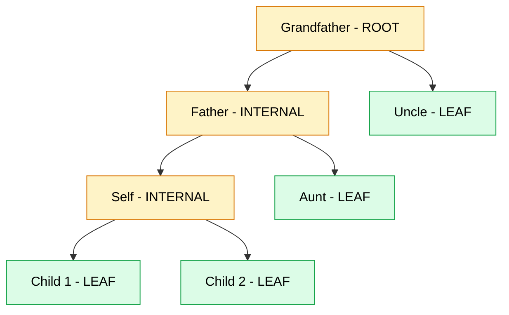
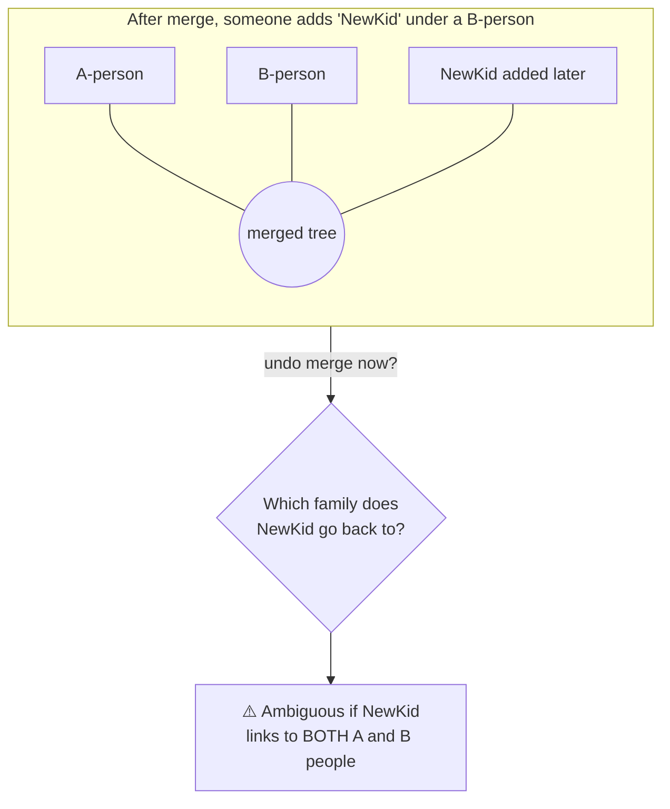

# Integrity Rules — Proposal Menu

> Goal: stop the tree/database from ever entering an **ambiguous or broken
> state**. These are *candidate* rules. Nothing here is implemented yet —
> pick the ones you want by ID (e.g. "apply R-A1, R-B1, R-C2") and I'll build
> only those.
>
> Each rule lists: **What** it says · **Why** · **Where** it would be enforced ·
> **Type** (🛑 hard block / ⚠️ warn-only / 🔧 background bookkeeping) · and how
> it interacts with **undo**.

---

## Shared vocabulary (so the rules are precise)

Relationships are `PARENT_OF` (from = parent → to = child), `SPOUSE_OF`,
`SIBLING_OF`. Using only `PARENT_OF` edges:

- **Children of P** = follow `PARENT_OF` *outbound* from P.
- **Descendants of P** = children, their children, … (transitive).
- **Ancestors of P** = follow `PARENT_OF` *inbound* (the parents above P).
- **Leaf** = a person with **no children** (no active outbound `PARENT_OF`).
  These are the "bottom / end of the tree" nodes.
- **Internal node** = a person who *has* children. Deleting one of these is
  the "delete from the middle" case you want to forbid.
- **Root** = a person with no parents recorded.

Green = safe to delete (leaf). Amber = deleting it would break the chain
below it.

---

## Category A — Node deletion safety

### R-A1 · Leaf-only deletion 🛑
**What:** A person can be deleted **only if they have no living children**
(no active outbound `PARENT_OF`). To remove an internal person you must delete
their descendants first, bottom-up.
**Why:** Deleting a middle node strands everyone below it — their link to the
ancestors is gone and the tree splits. This is the core rule you described.
**Where:** `deletePerson()` in `persons.service.ts`, before any soft-delete.
**Undo:** Unaffected — you can always undo a *valid* deletion.

### R-A2 · No-orphan guarantee (stronger form of A1) 🛑
**What:** A deletion is allowed only if, afterwards, **every remaining person
still has a path to the family root**. Catches edge cases A1 misses (e.g. the
node is a child's *only* bridge upward even without being a direct parent).
**Why:** A1 is "no children"; A2 is "no one gets disconnected" — fully
general. Pick A1 **or** A2, not both (A2 includes A1).
**Where:** `deletePerson()` — run a connectivity check on the post-delete graph.
**Undo:** Unaffected.

### R-A3 · Claimed / self nodes are never deletable 🛑 *(already in code)*
**What:** A node that a real user has claimed, or the logged-in user's own
node, can never be deleted — only its edges can be detached.
**Why:** A claimed node is a real account; deleting it would orphan a user.
**Where:** Already enforced in `deletePerson()`. Listed here for completeness.

### R-A4 · Childless-couple deletion is allowed ⚠️/🛑
**What:** Deleting one member of a **childless** couple is fine (they're a
leaf pair). If the couple has children, both are internal → blocked by A1/A2.
**Why:** Makes the leaf rule behave intuitively for spouses at the tree edge.
**Where:** Naturally falls out of A1/A2 — no separate code, just confirming the
intended behaviour.

### R-A5 · Explicit "delete branch" escape hatch 🛑 (opt-in)
**What:** If you *really* need to remove an internal node, offer a separate,
clearly-labelled **"Delete this person and all descendants"** action that
removes the whole subtree as **one undoable operation**.
**Why:** Gives a safe, intentional path for the rare legitimate case, without
allowing accidental middle-deletes. Skip this if you'd rather force bottom-up.
**Where:** New endpoint + service; reuses `withOperation()` so it's one
operation_id and fully reversible.

---

## Category B — Relationship removal safety

### R-B1 · No disconnecting parent-link removal 🛑
**What:** Removing a `PARENT_OF` edge is blocked if it is the child's link
holding their subtree to the rest of the family, i.e. removal would split the
graph into disconnected pieces.
**Why:** This is "remove relation from the middle which breaks the tree" — same
hazard as deleting a middle node, via a different door.
**Where:** `deleteRelationship()` in `relationships.service.ts`.
**Undo:** Unaffected.

### R-B2 · Spouse separation uses status, not deletion ⚠️ *(mostly in code)*
**What:** Ending a marriage should set `sub_type`/`is_active` (divorced,
separated, widowed) rather than hard-removing the `SPOUSE_OF` edge.
**Why:** Preserves history (kids still trace to both parents) and avoids
ambiguity about whether the marriage "never happened" vs "ended".
**Where:** Prefer `updateRelationship()` over `deleteRelationship()` for
spouse edges. Already partly supported via `ACTIVE_SPOUSE_SUBTYPES`.

### R-B3 · Sibling-group consistency 🔧
**What:** When a `SIBLING_OF` edge is removed, the remaining sibling set must
stay internally consistent (no half-broken groups). Removing a sibling link
between two people who are *also* siblings-via-shared-parent is redundant and
should be ignored, not allowed to create contradictions.
**Why:** Sibling edges are auto-fanned-out on create; ad-hoc removal can leave
a contradictory partial group.
**Where:** `deleteRelationship()` for `SIBLING_OF`.

---

## Category C — Merge reversibility (the "which tree does this node belong to" problem)

This is the second thing you raised. After Family A and Family B merge, people
keep adding nodes. If you later undo the merge, a node added *after* the merge
may legitimately belong to either side — or bridge both — and there's no clean
answer. These rules remove that ambiguity.

### R-C1 · Provenance tag on every node and edge 🔧
**What:** Add an `origin_family_id` to `persons` (and optionally
`relationships`) set at creation time and **never rewritten by a merge**
(merges only change `primary_family_id`). So we always know the tree a node
was *born* into.
**Why:** Lets an undo send each person back to its original family
deterministically, and lets us *detect* the ambiguous case.
**Where:** New column + populate on create; merge leaves it untouched.
**Undo:** Makes merge-undo far safer; foundation for C2–C4.

### R-C2 · Time-boxed merge undo 🛑
**What:** A merge can be undone only within a window (e.g. **24 hours / 7
days** — you choose) of being accepted. After that, the merge is **sealed**
and the History panel shows it as "permanent".
**Why:** The longer two trees live together, the more entangled new data
becomes. A short window keeps undo meaningful.
**Where:** `undoOperation()` rejects `merge.accept` operations older than the
window; History panel hides the Undo button for sealed merges.

### R-C3 · Activity-based sealing (stronger than C2) 🛑
**What:** A merge seals the moment **any new structural change touches the
combined tree** — a new person, a new cross-family relationship, or a stacked
merge — regardless of the clock.
**Why:** Directly targets your concern: as soon as new nodes are added on top
of the merge, undo becomes unsafe, so we lock it then. Can be combined with C2
(seal on *whichever comes first*: time **or** activity).
**Where:** Set a `sealed_at` on the `merge_records` row when post-merge
mutations are detected; `undoOperation()` checks it.

### R-C4 · Block undo when a new node bridges both origins 🛑
**What:** Even inside the window, refuse to undo a merge if a node added after
the merge has relationships to people from **both** original families (an
unsplittable bridge).
**Why:** This is the exact case with no correct answer — better to refuse than
guess and corrupt the data.
**Where:** `undoOperation()` validation using `origin_family_id` (needs C1).

### R-C5 · Undo merges in reverse order only 🛑
**What:** If merge M2 was accepted after merge M1 on the same family, M1 cannot
be undone until M2 is undone first.
**Why:** Unstacking out of order leaves dangling references and ambiguous
family membership.
**Where:** `undoOperation()` ordering check on `merge_records`.

---

## Category D — Always-on invariants (guardrails the rest rely on)

### R-D1 · No cycles in PARENT_OF 🛑 *(already in code)*
A person can't be their own ancestor. Enforced in `createRelationship()`.

### R-D2 · At most 2 parents per child 🛑 *(partly in code)*
**What:** A child may have at most two active `PARENT_OF` edges.
**Why:** Prevents biologically impossible / data-entry triple-parent states.
**Where:** Cascade inference already checks `< 2`; make it a hard rule on the
normal create path too.

### R-D3 · One active spouse unless polygamy flow used 🛑/⚠️
**What:** Adding a second active `SPOUSE_OF` must go through the
SecondSpouseWizard (which resolves the first marriage's status); silent
double-active-spouse is blocked.
**Why:** Avoids ambiguous "who is the current spouse / parent" states.
**Where:** `createRelationship()` for `SPOUSE_OF`.

### R-D4 · One primary family at a time 🔧 *(invariant)*
**What:** Every person has exactly one `primary_family_id`; merges move it
atomically, never leaving a person in two families or none.
**Why:** The whole graph is queried by family; a split membership is corruption.
**Where:** Already true; document it as an invariant the merge/undo must keep.

### R-D5 · Every mutation is atomic + audited 🛑 *(already in code)*
No write to tree tables outside `withOperation()`. This is what makes every
other rule undoable. Already enforced by the type system (repos require an
`OperationContext`).

### R-D6 · Undo is validated like a normal mutation 🛑
**What:** Undo must re-check the rules above. If restoring a row would create a
cycle, a 3rd parent, a disconnected node, or a sealed-merge violation, the undo
is **refused** (transaction rolls back) rather than forced through.
**Why:** A change that was legal when made can become illegal after later
edits; undo must not bulldoze current integrity.
**Where:** `undoOperation()` — wrap restores in the same validators.

---

## Quick pick-list

Tell me which to apply. A sensible **starter set** that covers exactly the two
problems you named:

| Priority | Rules | Covers |
|---|---|---|
| **Core (your two asks)** | **R-A1**, **R-B1**, **R-C1**, **R-C3** | no middle deletes, no tree-breaking edge removal, merge provenance, seal-on-activity |
| Recommended add-ons | R-A3*, R-D6, R-C5 | keep claimed-node safety, safe undo, ordered unmerge |
| Optional | R-A2 (instead of A1), R-A5, R-C2, R-C4, R-D2, R-D3 | stronger/extra guardrails |

\* already in code.

### Decisions I'll need once you pick
- **C2 window length** (24h? 7d?) — only if you choose time-boxing.
- **A1 vs A2** — simple "no children" block, or full connectivity check.
- **A5** — do you want the explicit "delete branch" escape hatch, or force
  strictly bottom-up deletion?
