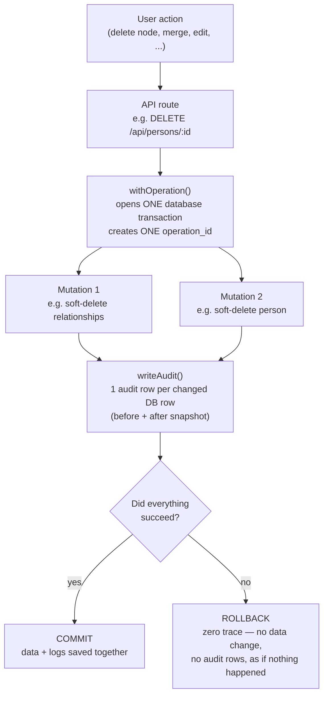
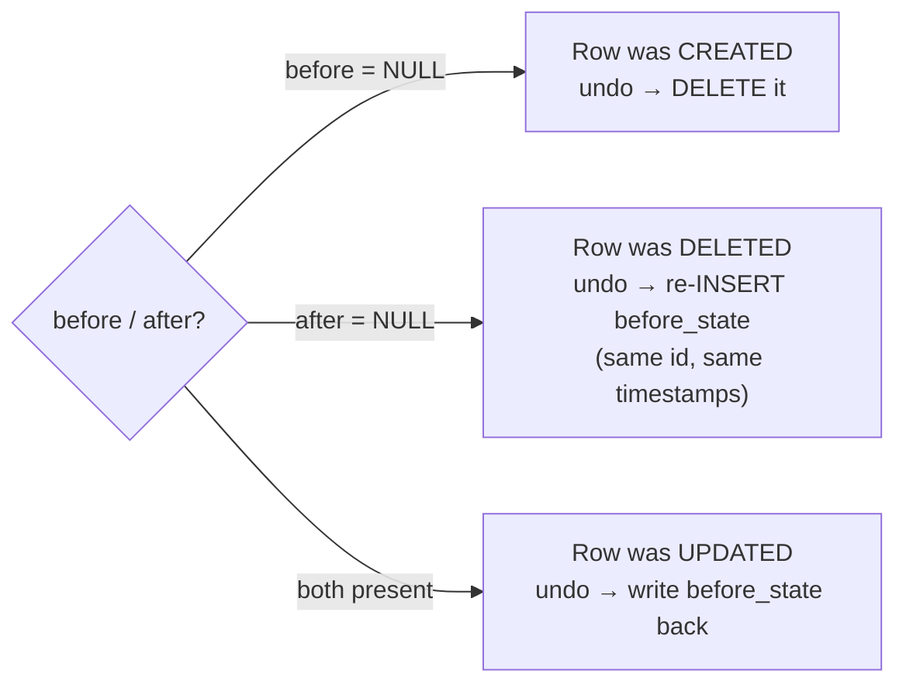
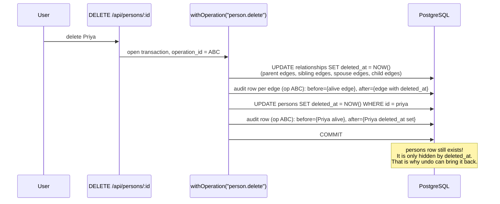
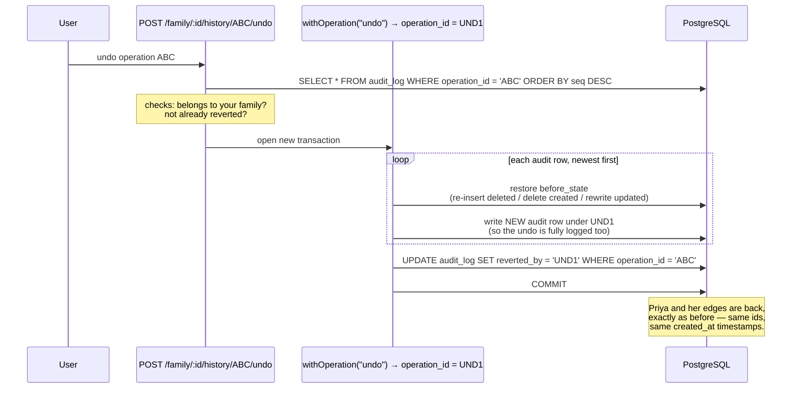
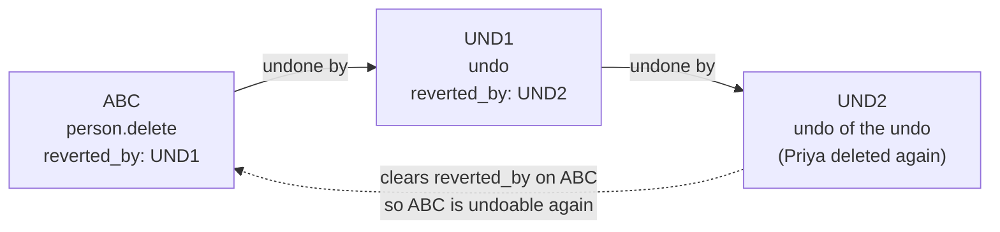
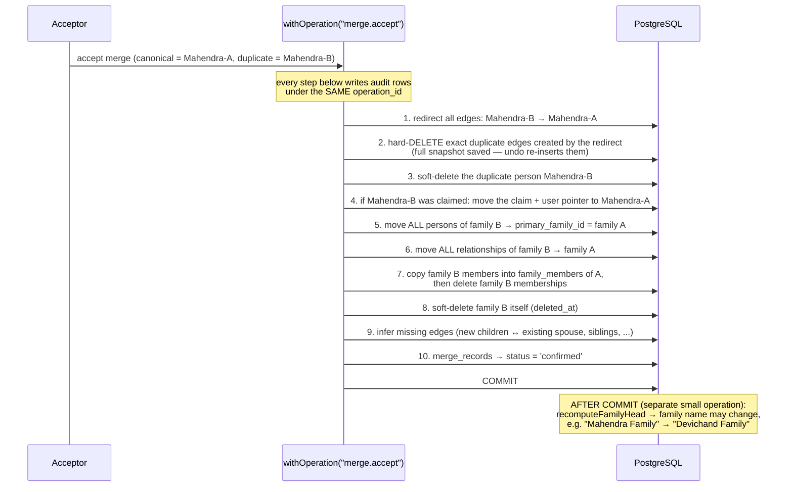
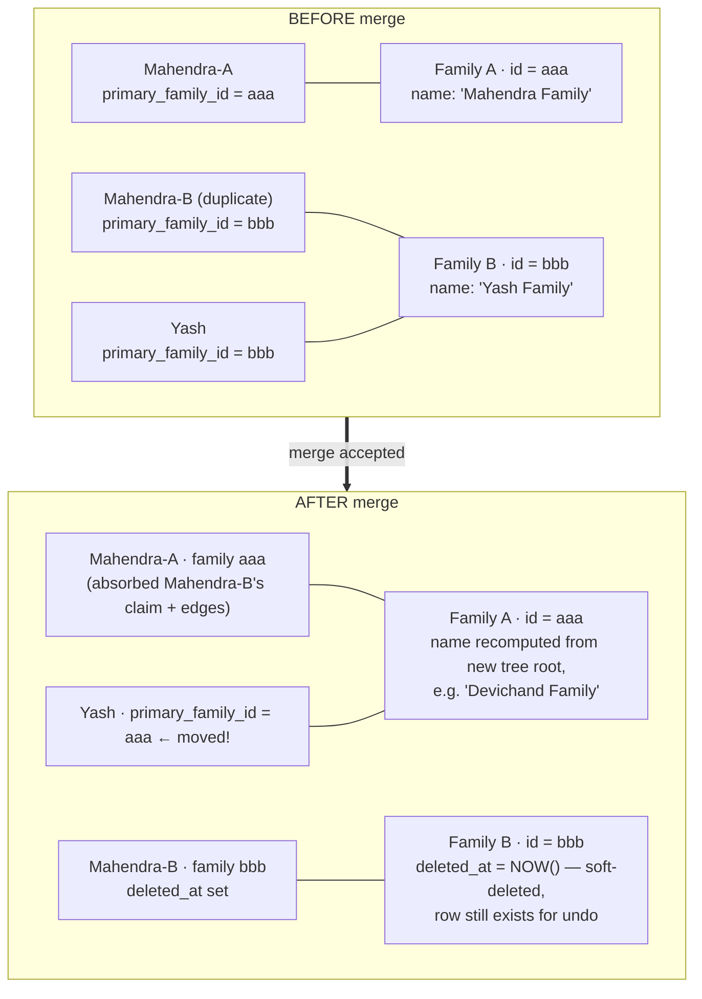
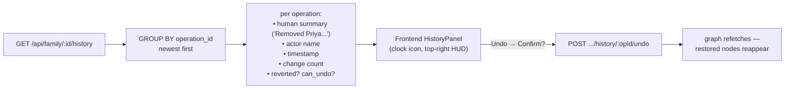

# Safety Net — Operation Log + Undo

> Phase 1 of the data-safety work. Every change to the family tree is recorded
> as an **operation** in the `audit_log` table, and every operation can be
> **undone** — including the undo itself. History is never deleted.
>
> Diagrams are [Mermaid](https://mermaid.js.org/) — they render on GitHub and
> in VS Code (with the Mermaid extension).

---

## 1. The big picture

Every mutation in the backend goes through the same pipeline. Nothing writes
to `persons`, `relationships`, `families`, `family_members`, or
`merge_records` without leaving a trace.

**Key idea:** data and logs live in the *same* transaction. You can never have
a change without its log entry, or a log entry without its change.

---

## 2. The `audit_log` table

One row = one database row that changed. One **operation_id** = one logical
user action (which may touch many rows).

| Column         | What it means                                                            |
|----------------|--------------------------------------------------------------------------|
| `operation_id` | Groups all rows of one user action. A merge = 1 operation, many rows.    |
| `seq`          | Insertion order. Undo replays rows **newest-first** (`seq DESC`).        |
| `action`       | What happened: `person.delete`, `merge.accept`, `undo`, ...              |
| `entity_type`  | Which table: `person`, `relationship`, `family`, `family_member`, ...    |
| `entity_id`    | The id of the changed row.                                               |
| `before_state` | Full JSON snapshot of the row **before** the change. `NULL` = created.   |
| `after_state`  | Full JSON snapshot of the row **after** the change. `NULL` = deleted.    |
| `actor_id`     | Which user did it (`NULL` = system, e.g. family-name recompute).         |
| `family_id`    | Which family's history this belongs to.                                  |
| `reverted_by`  | `NULL` = still in effect. Otherwise = the operation_id of the undo.      |

How undo knows what to do — just from the two snapshots:

---

## 3. Feature: Delete a node

**What you see:** you delete "Priya" from the tree.
**What actually happens:** her edges are *soft-deleted* (a `deleted_at`
timestamp is set — the rows stay in the database), then the node itself.

After this, `audit_log` contains (example):

| seq | operation_id | action          | entity_type  | before                 | after                  |
|-----|--------------|-----------------|--------------|------------------------|------------------------|
| 41  | **ABC**      | `person.delete` | relationship | `{deleted_at: null}`   | `{deleted_at: now}`    |
| 42  | **ABC**      | `person.delete` | person       | `{deleted_at: null}`   | `{deleted_at: now}`    |

Two DB rows changed → two audit rows → **one** operation_id → one entry in the
History panel: *"Removed Priya from the tree · 2 changes"*.

> Special case: claimed nodes (a real user's account) and nodes that still
> have their own family unit are never node-deleted — only their connecting
> edges are removed. The audit rows reflect exactly what was touched.

---

## 4. Feature: Undo

Undo reads all audit rows of an operation **newest-first** and restores each
row's `before_state`. The undo runs inside its own `withOperation()`, so it is
logged like any other operation — and can itself be undone.

### Undo the undo

History is append-only. Undoing an undo does **not** delete anything — it
creates a third operation that re-applies the original change:

The chain in plain words:

1. **ABC** deleted Priya.
2. **UND1** undid ABC → Priya is back. ABC is stamped `reverted_by = UND1`.
3. **UND2** undid UND1 → Priya is deleted again. UND1 is stamped
   `reverted_by = UND2`, **and** ABC's `reverted_by` is cleared — because
   ABC's effect is back in force, it must be undoable again.

All three operations stay in `audit_log` forever.

---

## 5. Feature: Merge (the big one)

A merge says: *"this duplicate node in family B is the same person as the
canonical node in family A."* On accept, **family B is absorbed into family
A** — and the whole thing is **one operation**, so one undo reverses all of it.

### What happens to `family_id` and the family name?

- **family_id never changes** for a surviving family — people are *moved* by
  rewriting their `primary_family_id` to point at family A.
- **Family B is never hard-deleted** — it gets `deleted_at` so logins, graph
  fetches, and searches skip it, but undo can clear that timestamp.
- **The family NAME is derived data**: after a merge (and after structural
  undos), `recomputeFamilyHead` walks `PARENT_OF` edges to the topmost
  ancestor and renames the family "*FirstName* Family". That rename is logged
  as its own tiny operation (`family.update_head`, actor = System) — and only
  when the name actually changes, so history stays clean.

### Undoing a merge

Because every step above saved a before-snapshot, undoing the merge operation
restores, newest-first: the merge_record to `proposed`, family B's
`deleted_at` to `NULL`, all memberships, every person's old
`primary_family_id`, the claim/user pointer, the hard-deleted duplicate edges
(re-inserted with their original ids), the redirected edges, and the duplicate
node. The two trees separate again.

---

## 6. Feature: History endpoint + panel

The summary is built from the snapshots themselves — e.g. a `person.delete`
operation finds the person row's `full_name` in its `before_state`, so the
panel can say *who* was removed without extra queries per row.

---

## 7. What every action writes (cheat sheet)

| You do this              | action            | Audit rows written                                                       |
|--------------------------|-------------------|--------------------------------------------------------------------------|
| Sign up                  | `family.create`   | family created, membership created, self person created, user→person pointer |
| Add a person             | `person.create`   | 1 person row (after only)                                                |
| Edit a person            | `person.update`   | 1 person row (before + after)                                            |
| Send an invite           | `person.invite`   | 1 person row (token + state change)                                      |
| Claim a node             | `person.claim`    | person update + membership insert                                        |
| Delete a person          | `person.delete`   | every removed edge + the node (if node-deleted)                          |
| Add a relationship       | `relationship.create` | the edge + any auto-created sibling-group edges                      |
| Delete a relationship    | `relationship.delete` | 1 edge (soft-delete as update)                                       |
| Re-mother children       | `person.reparent` | old mother edges removed + new edges created                             |
| Request / reject a merge | `merge.request` / `merge.reject` | 1 merge_record row                                        |
| Accept a merge           | `merge.accept`    | everything in section 5 — often 10–50+ rows, one operation               |
| Undo anything            | `undo`            | 1 row per restored row + a marker naming the reverted operation          |
| (automatic) name recompute | `family.update_head` | 1 family row, only when the name/head actually changed              |

**Deliberately NOT logged** (and why):

- `families.person_code_seq` bumps — a forever-increasing counter; rewinding
  it on undo would hand out duplicate person codes.
- User account data (email, password hash, reset tokens) — account stuff, not
  tree data. Only the `users.person_id` graph pointer is snapshotted.
- Notifications — derived side-effects, recreated by normal use.

---

## 8. Where the code lives

| Piece                    | File                                                  |
|--------------------------|-------------------------------------------------------|
| Table migration          | `database/migrations/015_audit_operations.sql`        |
| Writer + wrapper + helpers | `src/utils/audit.ts`                                |
| Undo + history queries   | `src/services/history.service.ts`                     |
| HTTP routes              | `src/routes/history.routes.ts` (mounted at `/api/family`) |
| End-to-end proof         | `database/verifyRecovery.ts` → `npm run verify:recovery` |
| Frontend panel           | `frontend/components/graph/HistoryPanel.tsx`          |
| Frontend API             | `frontend/lib/api/history.ts`                         |
